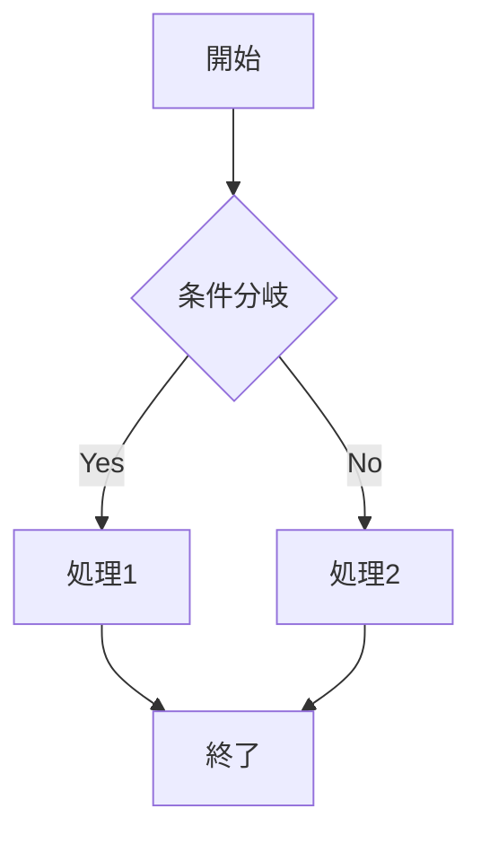
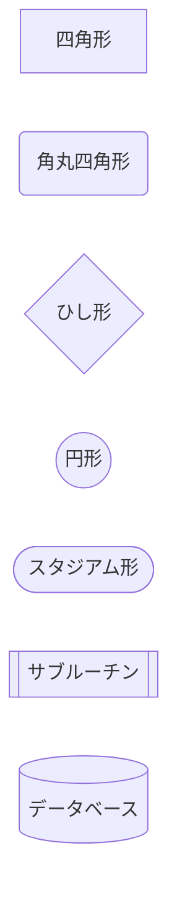
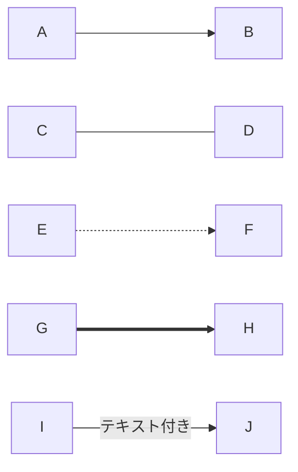
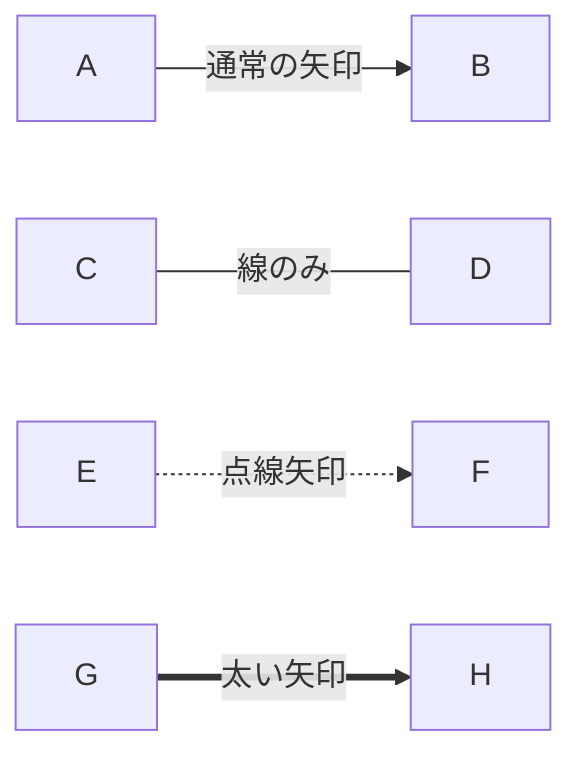
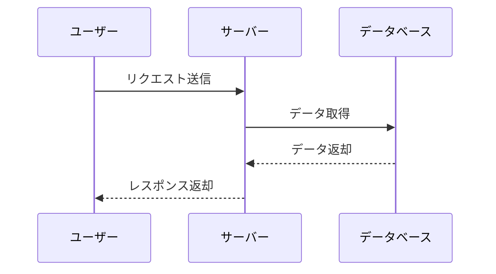
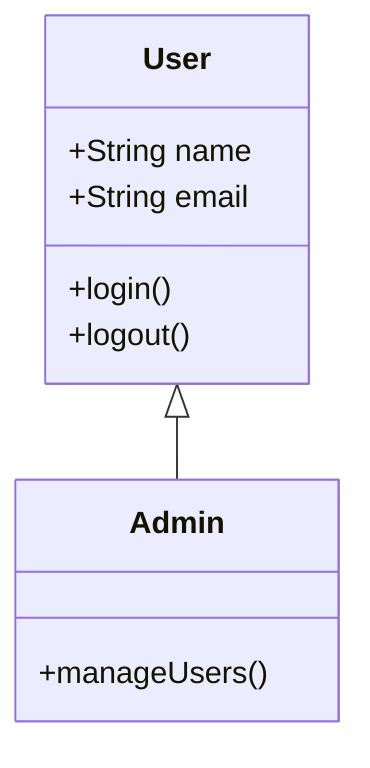
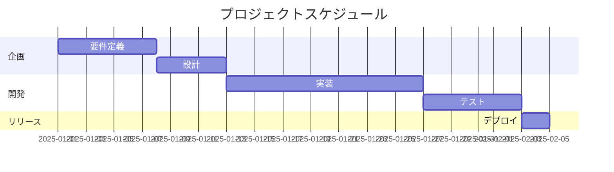
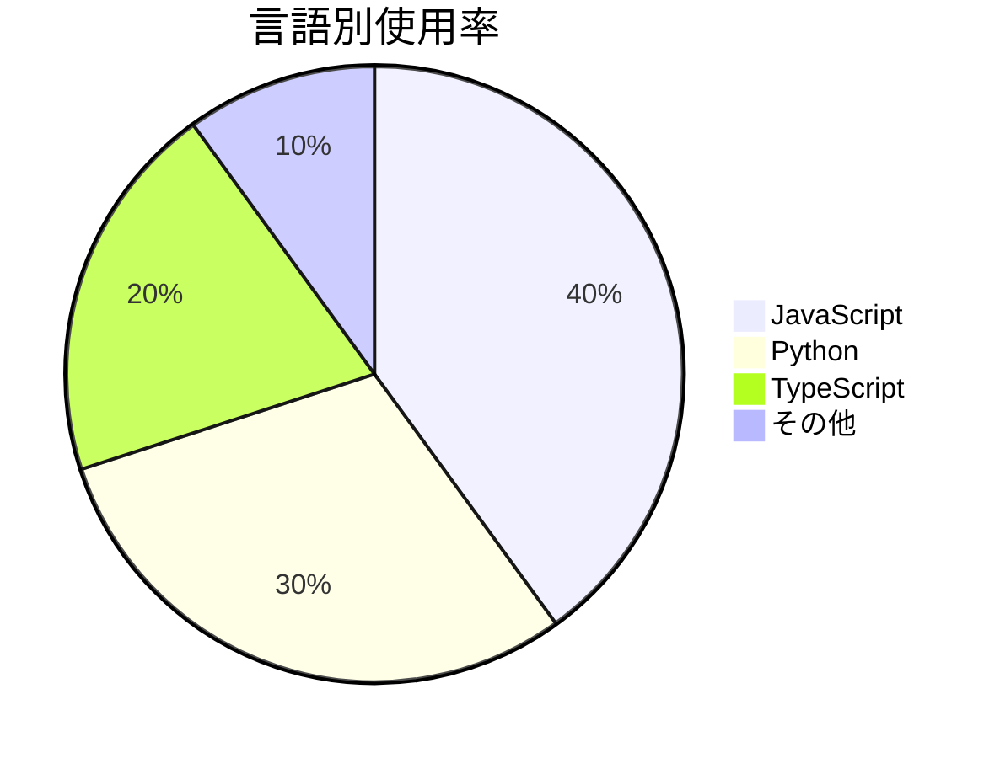
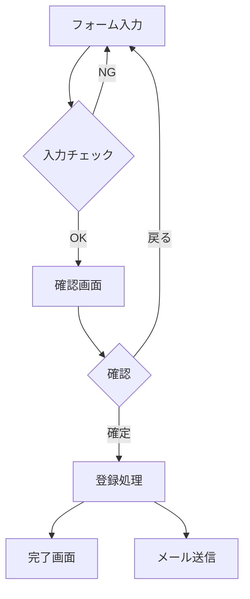
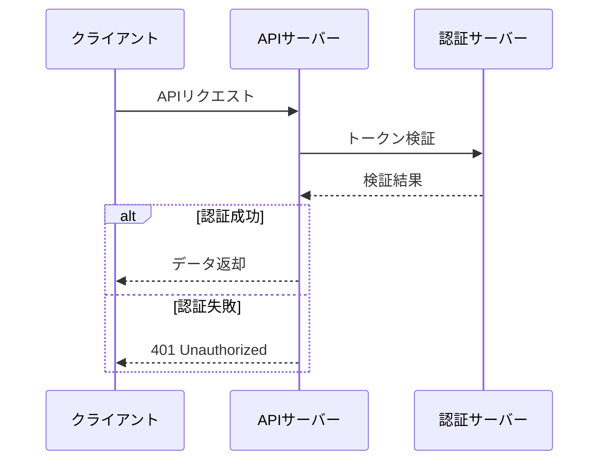

# 図表（Mermaid）サンプル

## 解説

Mermaid（マーメイド）は、テキストで図を描画できる記法です。
コードブロックで `mermaid` を指定して使用します。

**対応環境**: GitHub、Notion、Obsidian

---

## フローチャート

### 記法

````markdown

````

### 表示結果


### 方向の指定

| 記法 | 方向 |
|------|------|
| `graph TD` | 上から下（Top to Down） |
| `graph LR` | 左から右（Left to Right） |
| `graph BT` | 下から上（Bottom to Top） |
| `graph RL` | 右から左（Right to Left） |

---

## ノードの形状

### 記法

````markdown

````

### 表示結果


---

## 矢印のスタイル

### 記法

````markdown

````

### 表示結果



---

## シーケンス図

### 記法

````markdown

````

### 表示結果


---

## クラス図

### 記法

````markdown

````

### 表示結果


---

## ガントチャート

### 記法

````markdown

````

### 表示結果


---

## 円グラフ

### 記法

````markdown

````

### 表示結果


---

## 実用例

### ユーザー登録フロー

````markdown

````


---

### API通信フロー

````markdown

````


---

## 主な図の種類

| 種類 | キーワード | 用途 |
|------|------------|------|
| フローチャート | `graph` | 処理の流れ |
| シーケンス図 | `sequenceDiagram` | 通信の流れ |
| クラス図 | `classDiagram` | クラス構造 |
| ガントチャート | `gantt` | スケジュール |
| 円グラフ | `pie` | 割合の表示 |
| ER図 | `erDiagram` | DB設計 |
| 状態遷移図 | `stateDiagram-v2` | 状態変化 |

---

## 参考リンク

- [Mermaid公式ドキュメント](https://mermaid.js.org/)
- [Mermaid Live Editor](https://mermaid.live/)（オンラインで試せる）

---

## 実習

以下のフローチャートを作成してみましょう。

1. 朝起きてから家を出るまでの流れ
2. ログイン処理のフロー
