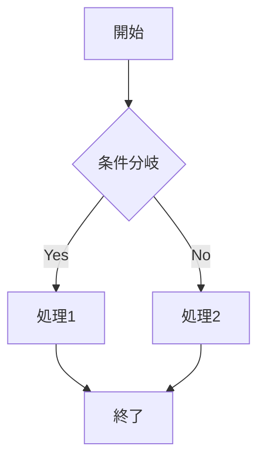

# マークダウン応用記法リファレンス

基礎講座で学んだ記法に加えて、知っておくと便利な応用的な記法を紹介します。

環境（GitHub、Notion、Obsidianなど）によって対応状況が異なるため、使用前に確認してください。

---

## 折りたたみ（details / summary）

長いコードやログを折りたたんで表示できます。

```html
<details>
<summary>クリックして展開</summary>

ここに隠したい内容を書きます。

- リストも使えます
- コードブロックも入れられます

</details>
```

**対応環境**：GitHub、多くのマークダウンエディタ

---

## 脚注（Footnotes）

本文中に注釈を付けられます。

```markdown
これは本文です[^1]。別の参照もできます[^note]。

[^1]: これが脚注の内容です。
[^note]: 名前付きの脚注も可能です。
```

**対応環境**：GitHub、Obsidian、多くのマークダウンエディタ

---

## アラート / 注意書き（GitHub Alerts）

注意事項や補足情報を目立たせます。

```markdown
> [!NOTE]
> 補足情報です。

> [!TIP]
> 便利なヒントです。

> [!IMPORTANT]
> 重要な情報です。

> [!WARNING]
> 注意が必要です。

> [!CAUTION]
> 危険な操作です。
```

**対応環境**：GitHub

---

## 数式（LaTeX記法）

数学的な式を表現できます。

```markdown
インライン数式：$E = mc^2$

ブロック数式：
$$
\sum_{i=1}^{n} x_i = x_1 + x_2 + \cdots + x_n
$$
```

**対応環境**：GitHub、Notion、Obsidian、Jupyter Notebook

---

## 図表（Mermaid）

コードブロックでフローチャートやシーケンス図を描画できます。

````markdown

````

**対応環境**：GitHub、Notion、Obsidian

---

## 絵文字ショートコード

絵文字を記号で入力できます。

```markdown
:smile: :thumbsup: :rocket: :warning: :white_check_mark:
```

**対応環境**：GitHub、Slack、Discord

---

## コメント（非表示テキスト）

レンダリングされない隠しメモを残せます。

```markdown
<!-- これはコメントです。表示されません -->

[//]: # (これも隠しコメントの書き方)
```

**対応環境**：ほぼすべてのマークダウン環境

---

## エスケープ

記号をそのまま表示したいときに使います。

```markdown
\*アスタリスク\*
\# シャープ
\`バッククォート\`
\| パイプ
```

**対応環境**：すべてのマークダウン環境

---

## 定義リスト

用語と定義をセットで表示します。

```markdown
用語1
: 定義1の説明

用語2
: 定義2の説明
```

**対応環境**：一部（Pandoc、PHP Markdown Extra）

---

## 目次リンク

見出しへのページ内リンクを作成できます。

```markdown
## 目次
- [セクション1](#セクション1)
- [セクション2](#セクション2)

## セクション1
内容...

## セクション2
内容...
```

**注意**：日本語見出しのアンカー生成ルールは環境によって異なります。

---

## 対応環境まとめ

| 記法 | GitHub | Notion | Obsidian | VSCode |
|------|:------:|:------:|:--------:|:------:|
| 折りたたみ | ✅ | ✅ | ✅ | ✅ |
| 脚注 | ✅ | ❌ | ✅ | ✅ |
| アラート | ✅ | ❌ | ❌ | ❌ |
| 数式 | ✅ | ✅ | ✅ | 拡張 |
| Mermaid | ✅ | ✅ | ✅ | 拡張 |
| 絵文字 | ✅ | ✅ | ✅ | ❌ |
| コメント | ✅ | ✅ | ✅ | ✅ |

---

## 参考リンク

- [GitHub Flavored Markdown Spec](https://github.github.com/gfm/)
- [Mermaid公式ドキュメント](https://mermaid.js.org/)
- [LaTeX数式チートシート](https://katex.org/docs/supported.html)